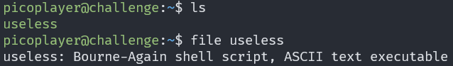
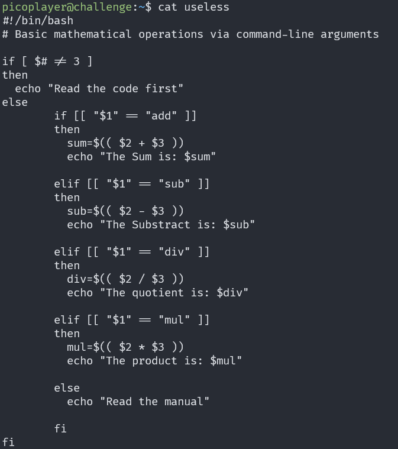
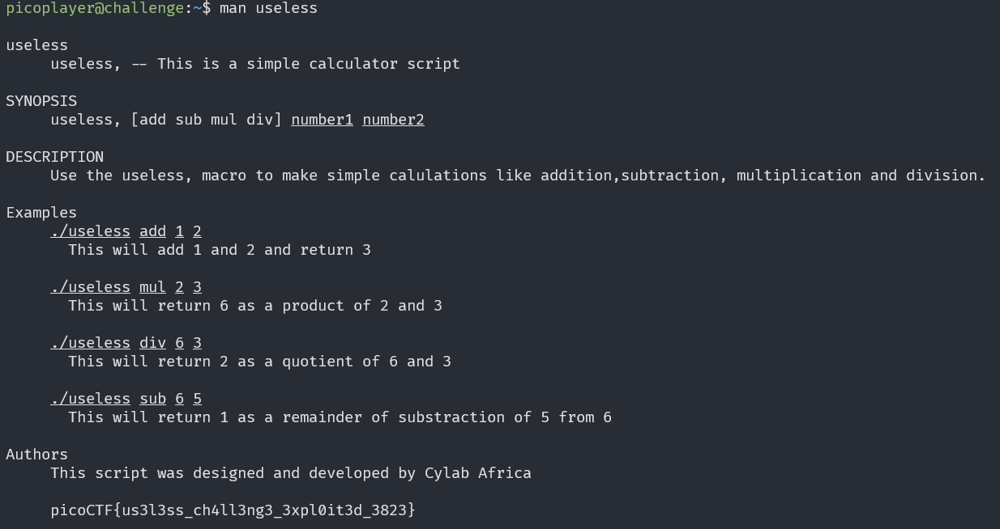

# useless

## Description

There's an interesting script in the user's home directory The work computer is running SSH. We've been given a script which performs some basic calculations, explore the script and find a flag.

## Approach

For this challenge we need to connect to a server using `ssh`

When we get on the server we see a single Bash script called `useless`

When we read the script we can see that it needs 3 arguments to run but none of these options gives us a flag.

The else block says read the manual so I tried `man useless` which opened a manual

We can see at the end of the manual is the flag.
