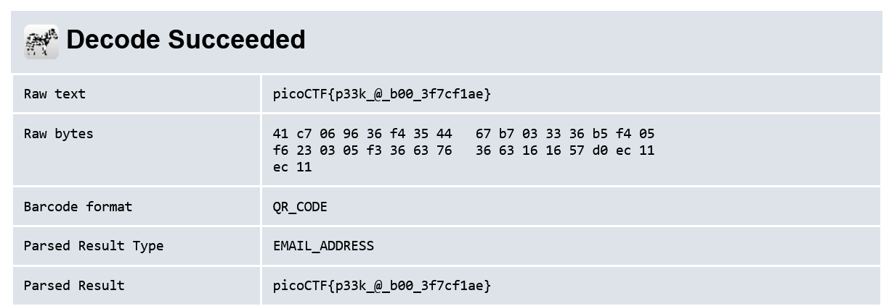

# Scan Surprise

## Description

I've gotten bored of handing out flags as text. Wouldn't it be cool if they were an image instead?

## Approach

We are given the file `flag.png` which is a QR code

I used the an [Online QR Decoder](https://zxing.org/w/decode.jspx) to get the text from the QR which was the flag.

