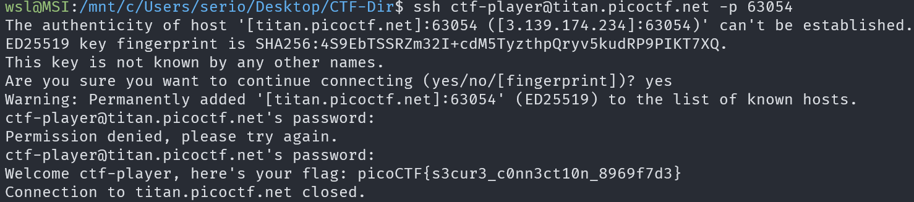

# Super SSH

## Description

Using a Secure Shell (SSH) is going to be pretty important.

Can you ssh as `ctf-player` to `titan.picoctf.net` at port `63054` to get the flag? You'll also need the password `83dcefb7`. If asked, accept the fingerprint with yes.

## Approach

To ssh into this system all we need to do is run the command `ssh ctf-player@titan.picoctf.net -p 63054`

After we connect we are given the flag

