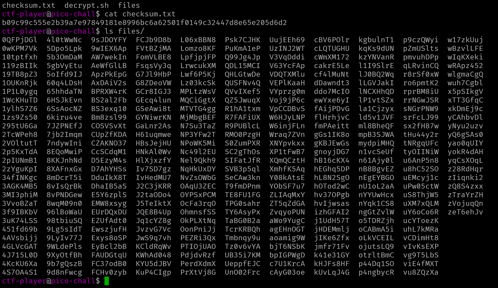
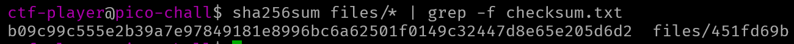
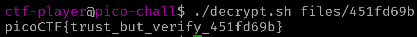

# Verify

## Description

People keep trying to trick my players with imitation flags. I want to make sure they get the real thing! I'm going to provide the SHA-256 hash and a decrypt script to help you know that my flags are legitimate.

## Approach

After connecting to the instance we see 2 files and a folder with a bunch of files

We need to get the **SHA256** hash of each file in `files/` and check it against the hash in `checksum.txt`.

We can actually use the command `sha256sum files/* | grep -f checksum.txt` to find the file we are looking for.

Next we can use `decrypt.sh` to get the flag.

Command: `./decrypt.sh files/451fd69b`

