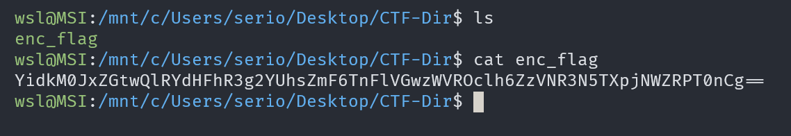
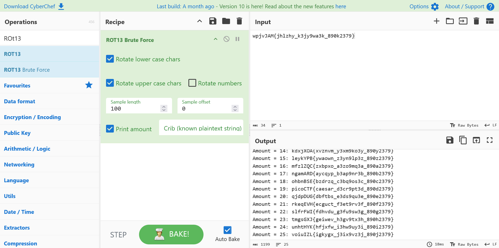

# interencdec

## Description

Can you get the real meaning from this file.

## Approach

We are given the file `enc_flag` which contains some base64 text



I tried to decode the base64 which resulted in more base64 surrounded by the binary string thing from **Python**

So I continued decoding with python until I got something that looked like the flag format

``` Python
import base64

with open("enc_flag", "r") as fr:
    text = fr.read()

text1 = base64.b64decode(text).decode()[2:-2]

text2 = base64.b64decode(text1).decode()

print(text2)
```

**The Script will give the flag formatted string**

I then took it to CyberChef and tried used ROT13 Bruteforce to check if it's a caeser ciphertext



We can see the key of `19` will give us the flag
