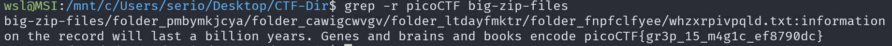

# Big Zip

## Description

Unzip this archive and find the flag.

## Approach

I download the `.zip` file and extracted it which gave like a million `.txt` files in various directories

While I'm waiting for this I'm going to explain what I'm planning. I'm going to use a **recursive grep** to look for the flag pattern in the directories. The first command will be `grep -r picoCTF big-zip-files/`

And that worked!!! Now I have the flag

