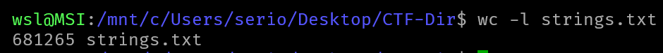
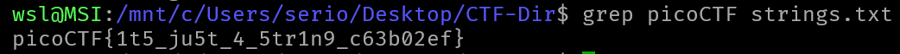

# DISKO 1

## Description

Can you find the flag in this disk image?

## Approach

We are given the disk image `disko-1.dd`

I first ran `strings` on it to see if the flag was in the output but it returned a ton of strings so I redirected it to `strings.txt` using `strings disko-1.dd > strings.txt`.

After that completed I ran `grep picoCTF strings.txt` to search the output for the flag.

And we got the flag!!!
