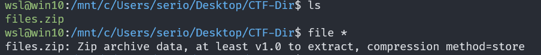
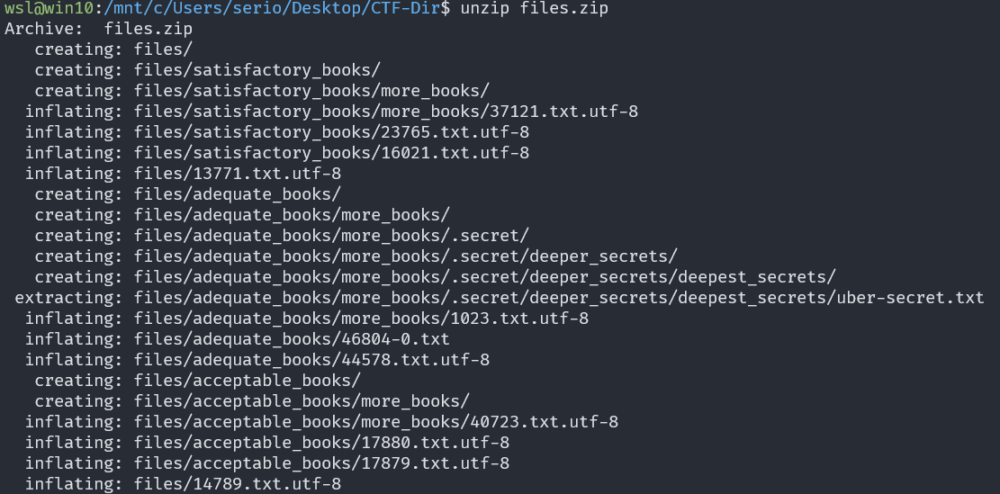
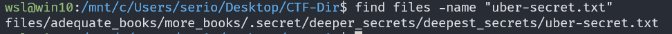

# First Find

## Description

Unzip this archive and find the file named 'uber-secret.txt'

## Approach

After unzipping the `files.zip` we can see the file very obviously in the output

For the sake of the challenge I used `find` anyway with the command `find files/ -name "uber-text.txt"` which showed the path to the file

Reading the file will give you the flag.
