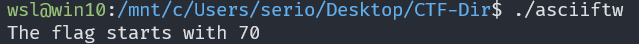
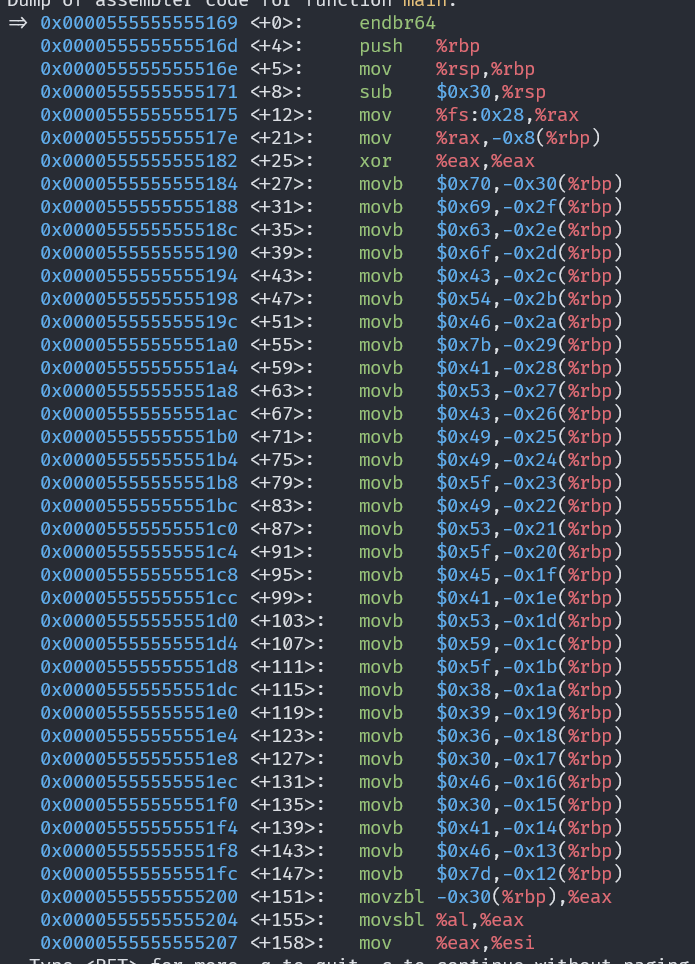
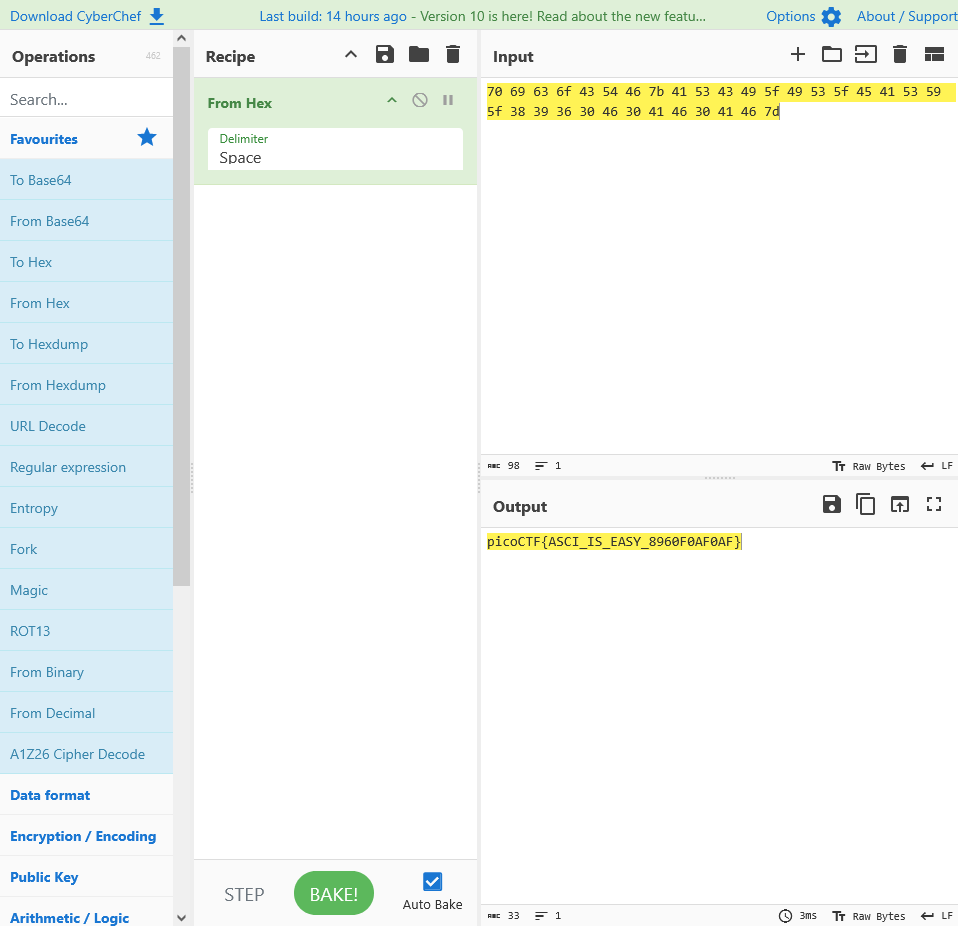

# ASCII FTW

## Description

This program has constructed the flag using hex ascii values. Identify the flag text by disassembling the program.

## Approach

I began by running `asciiftw` which said the flag starts with 70

I ran the program through `xxd` and `strings` to see if the number 70 came up anywhere but nothing came up.

Then I ran it with `gdb` and set a breakpoint at the `main()` method using `b*main`. Then I disassembled it using `disass` and it looked like a string of ascii values.

Then I entered the values from `0x70` to `0x7d` into **CyberChef** and used the From Hex recipe which gave the flag.

