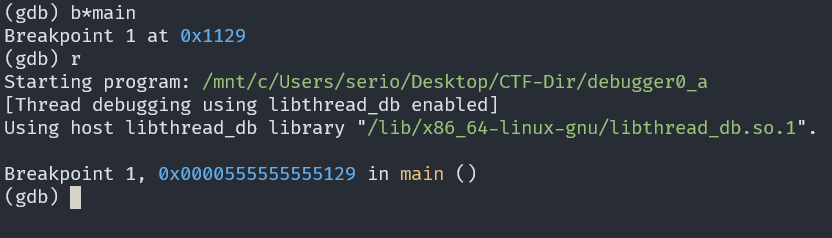
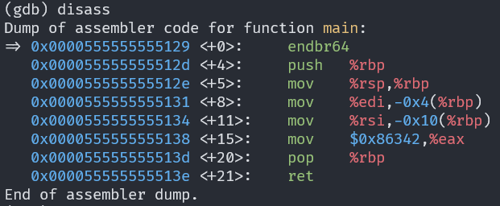

# GDB baby step 1

## Description

Can you figure out what is in the eax register at the end of the main function? Put your answer in the picoCTF flag format: picoCTF{n} where n is the contents of the eax register in the decimal number base. If the answer was 0x11 your flag would be picoCTF{17}.

## Approach

We are given the executable `debugger0_a`. To get into the main function we need to set a **breakpoint** so the program pauses at that point.

To add it to main we can use `b*main` then entering `run` will take us to the breakpoint.

We want to see what `eax` has at the end of main so we can disassemble the function using the `disass` command.

We can see that `0x86342` gets moved into `eax`.

In decimal this equals to **549698** which is the flag.
