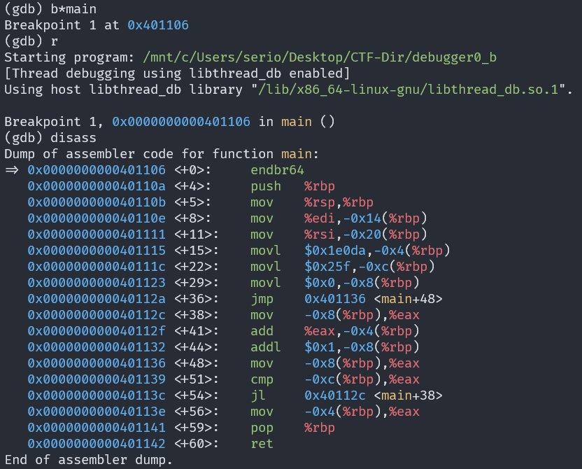
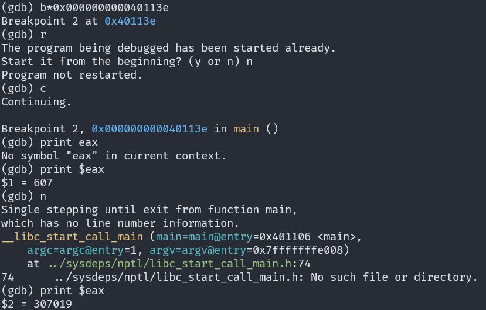

# GDB baby step 2

## Description

Can you figure out what is in the eax register at the end of the main function? Put your answer in the picoCTF flag format: picoCTF{n} where n is the contents of the eax register in the decimal number base. If the answer was 0x11 your flag would be picoCTF{17}.

## Approach

Following the steps from the first challenge in this set I set a breakpoint at the main function and disassembled it.

We can see that where `eax` is modified last which is at `0x000000000040113e`.

We can set another breakpoint there and inspect the register.

I moved to the next instruction because I realised I set the breakpoint before the final modification.

This is our flag btw!!
