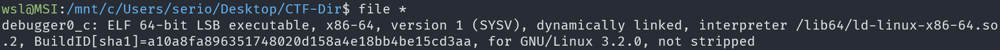
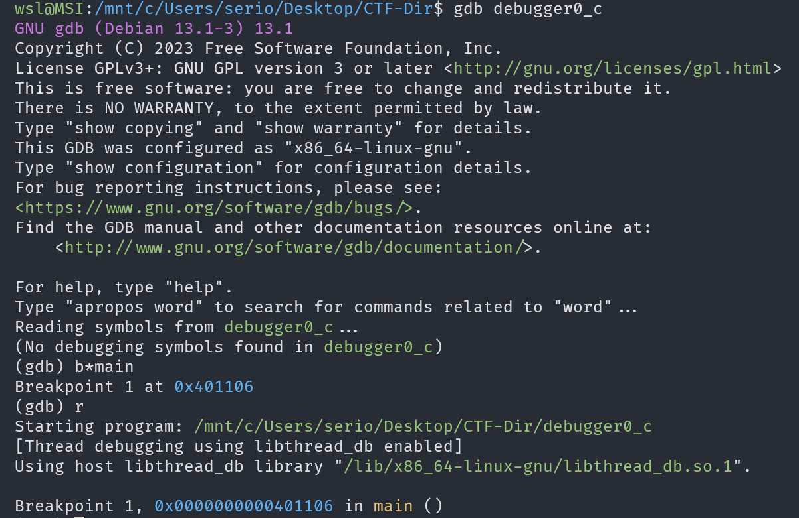
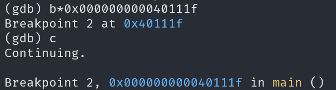
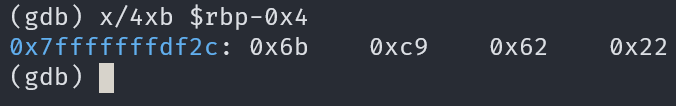

# GDB baby step 3

## Description

Now for something a little different. `0x2262c96b` is loaded into memory in the `main` function. Examine byte-wise the memory that the constant is loaded in by using the GDB command `x/4xb addr`. The flag is the four bytes as they are stored in memory. If you find the bytes `0x11 0x22 0x33 0x44` in the memory location, your flag would be: `picoCTF{0x11223344}`.

## Approach

We are given the file `debugger0_c`

Starting off I'm going to open the program in **gdb** using `gdb debugger0_c` then set a breakpoint at `main` to find the address we are looking for.

Next I'm going to run `disass` in gdb to get the disassembly to see where the constant is loaded

We can see that the constant is loaded into `rbp-0x4` at address `0x000000000040111c`

Now I'm going to set a breakpoint at the next instruction and wait till we get there.

So we should inspect that piece of memory using the command in the description to get the flag.

Command: `x/4xb $rbp-0x4`

Now we can put this in the described format to and that's the flag!
