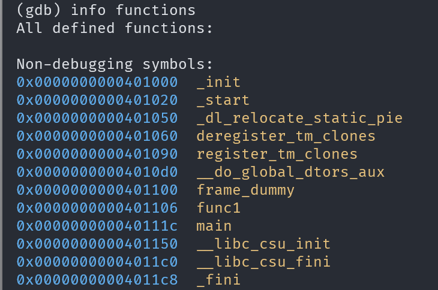

# GDB baby step 4

## Description

`main` calls a function that multiplies `eax` by a constant. The flag for this challenge is that constant in decimal base. If the constant you find is 0x1000, the flag will be `picoCTF{4096}`.

## Approach

We are given the file `debugger0_d`

Starting off I opened the file in `gdb` and looked if we can see the functions using `info functions`

We can see that the only other real function is `func1` so I just went straight for that by looking the the assembly using `disass func1`

We can see that `eax` is multiplied with 1 constant `0x3269` which is the value we are looking for to get the flag.

Converting it to decimal gives `0x3269 = 12905` which gets put in the usual format to get the flag!
