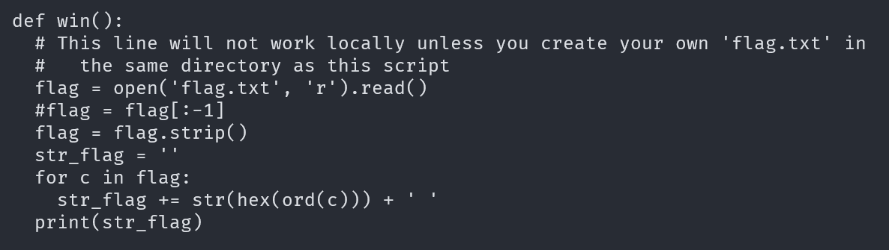
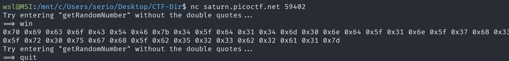
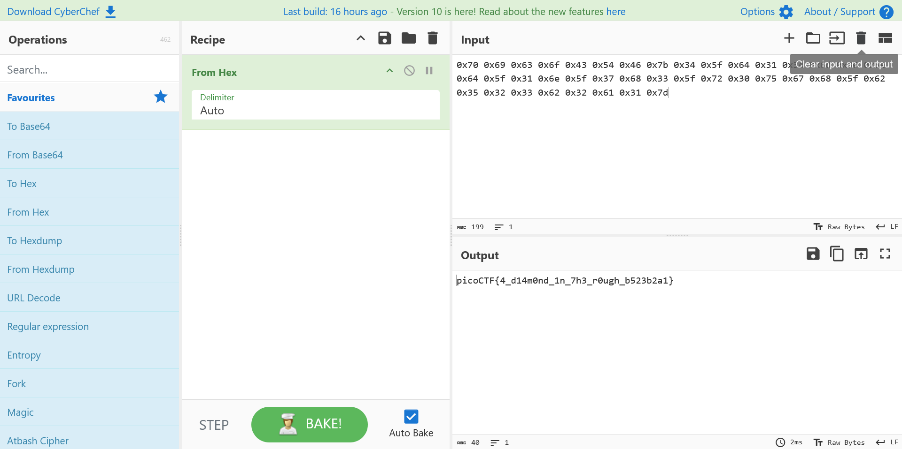

# Picker I

## Description

This service can provide you with a random number, but can it do anything else?

## Approach

We are given an address to connect to and the source code for the program

### Source Code

Opening the contents of `Picker-I.py` shows alot of code but the important part is at the end.

```Python
while(True):
  try:
    print('Try entering "getRandomNumber" without the double quotes...')
    user_input = input('==> ')
    eval(user_input + '()')
  except Exception as e:
    print(e)
    break
```

We can see that anything we input will be evaluated as python code but our input will have `()` to the end of it.

I can see that we have the function `win()` which just prints out the flag



### Service

After connecting to the service I entered `win` as my input which returned some **Hex Values**.



### Decoding Hex

Next I'm going to [CyberChef](https://gchq.github.io/CyberChef/) to use their `From Hex` recipe to decode the output of the service.



And the output is the flag!!
