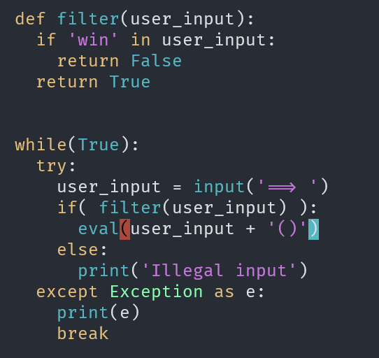
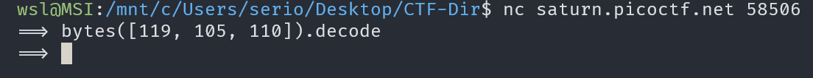
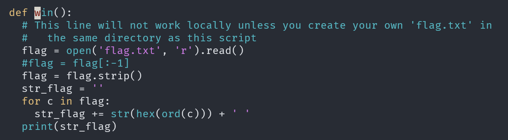
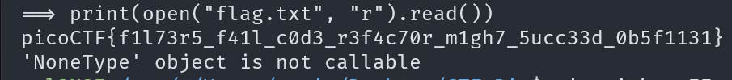

# Picker II

## Description

Can you figure out how this program works to get the flag?

## Approach

For this challenge we are given a program to connect to and the source code.

### Source Code

First I'm going to try see what the program does to try and get the flag

This time we can see that our user input is filtered before it's put into `eval()`. It simply checks if `win` is in the user input but we can obfuscate (hide) win in our message using `bytes()`

Our payload could be `bytes([119, 105, 110]).decode` which simple create a bytes object using the ascii of `win` then decodes it info utf-8. In other words when this gets run in python it will return the string `win` which should give us our flag.

**Note**: We don't put () after decode since it's added before the eval

### Service

As you can see it didn't work. I quickly realised its because we are just creating the string `"win"` but not calling the function `win()`.

Because of this I completely switched up my tactic, instead of calling `win()` im just going to read the file directly.

We can see the flag can be accessed as just `flag.txt`. Because of this my new payload is going to be `print(open("flag.txt", "r").read())`. Even though the brackets are added, it'll just return None but still print out the output of `.read()`.

And that is our flag!
