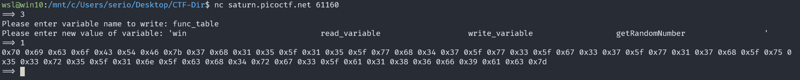
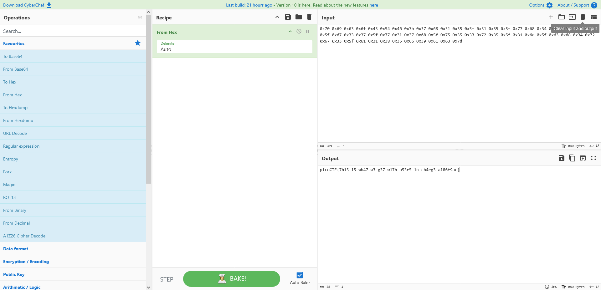

# Picker III

## Description

Can you figure out how this program works to get the flag?

## Approach

We are, as always, given an address and source code for a serer hosted program.

### Source Code

This time the program is much more complex and has a completely different flow.

Skimming through we can see that we can do a couple things:

- Call a function from the `func_table`
- Read a variable from the program
- Override the value of a variable
- `GetRandomNumber()` as always

Given this the gameplan is going to be:

1. Add `win()` to the `func_table`
2. Call `win()` from the `func_table`
3. Get Flag!!!!

```Python
FUNC_TABLE_SIZE = 4
FUNC_TABLE_ENTRY_SIZE = 32

def reset_table():
  global func_table

  # This table is formatted for easier viewing, but it is really one line
  func_table = \
'''\
print_table                     \
read_variable                   \
write_variable                  \
getRandomNumber                 \
'''

def check_table():
  global func_table

  if( len(func_table) != FUNC_TABLE_ENTRY_SIZE * FUNC_TABLE_SIZE):
    return False

  return True
```

We can see how the table is formatted and we also have a function that checks the format of the table.

`func_table` is a single string which contains names of functions in the program. There are a total of 4 fields and each should be 32 characters in length to be valid.

`func_table = 'win                             read_variable                   write_variable                  getRandomNumber                 '`

It doesn't render in markdown but there are meant to be a bunch of spaces after each entry.

### Service

The gameplan now is use `write_variable()` to override the value of `func_table` to `'win                             read_variable                   write_variable                  getRandomNumber                 '`

Then enter 1 to run `win()` and get the flag value.



It returned hex so as always I'll put it into CyberChef to get the flag


