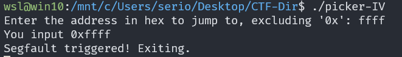
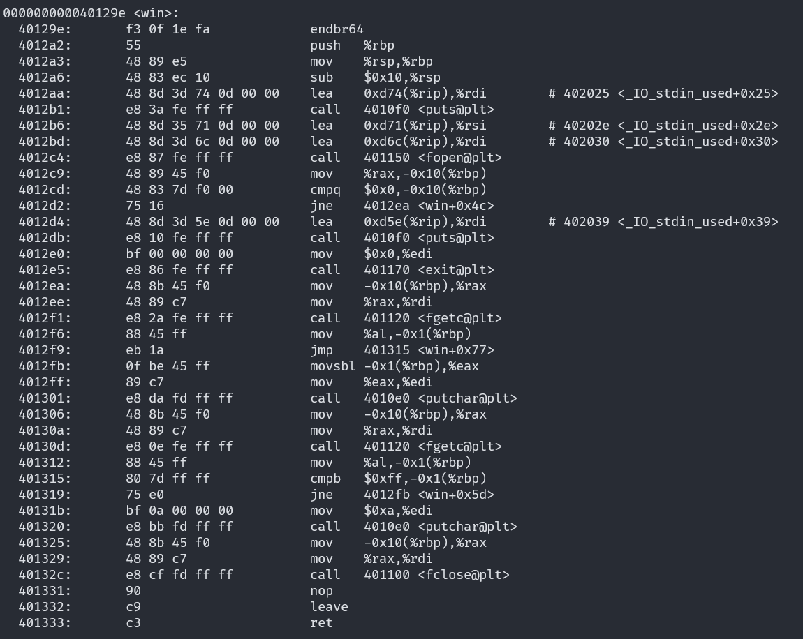
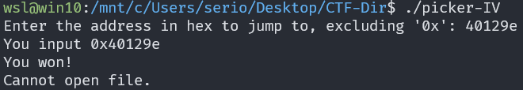
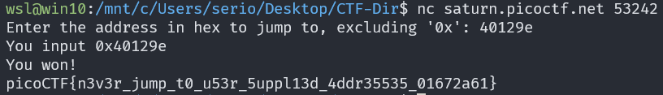

# Picker IV

## Description

Can you figure out how this program works to get the flag?

## Approach

This time we are given a binary executable and an address

### Executable

I ran the program which asked for an address to jump to, in this case I'm assuming we are looking for a function `win()` or something like that.

Using the command `objdump -d picker-IV` to disassemble the program. We can see a section labelled `win` with the address `40129e`.

Now I tried running the program but entering the address I found which said we got to the right location! Now we need to try it on the server.

### Server

Now we can connect to the service and enter the address to get the flag.

