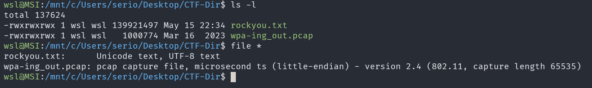
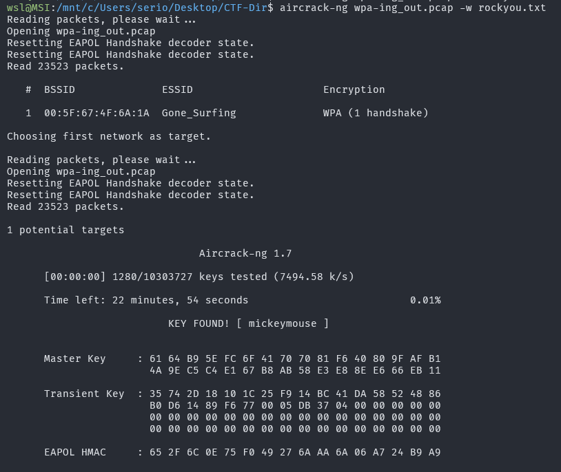

# WPA-ing Out

## Description

I thought that my password was super-secret, but it turns out that passwords passed over the AIR can be CRACKED, especially if I used the same wireless network password as one in the rockyou.txt credential dump.

## Approach

We are giving a `pcap` file that supposedly contains a password that can be "aircracked"

Considering the hints in the description we can use `aircrack-ng` to bruteforce the password from this `pcap`.

We only need the pcap and and a wordlist to use this tool so we can go aheed and use the command: `aircrack-ng wpa-ing_out.pcap -w rockyou.txt`

And thats the flag!!!
