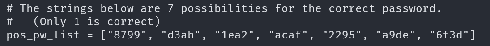
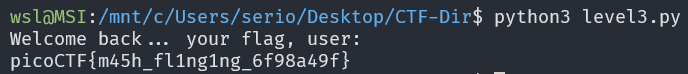

# PW Crack 3

## Description

Can you crack the password to get the flag? 

Download the password checker here and you'll need the encrypted flag and the hash in the same directory too.

There are 7 potential passwords with 1 being correct. You can find these by examining the password checker script.

## Approach

For this challenge we are given the following files:

Inside the script we can see a conveniently defined list of possible passwords

Instead of manually checking the paswords I'm going to modify `level_3_pw_check()` function by removing the user input and getting it to try each password automatically

Now when we run it we should get the flag

