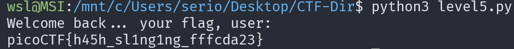

# PW Crack 5

## Description

Can you crack the password to get the flag?

Download the password checker here and you'll need the encrypted flag and the hash in the same directory too.

Here's a dictionary with all possible passwords based on the password conventions we've seen so far.

## Approach

This time along with all the regular files we are given a dictionary of passwords to try instead of list in the script.

But our program logic is still the same so this time I'm going to read in the list of possible passwords first then get the program to test them.

**Edited Code:**

Now when we run the program we should get the flag

