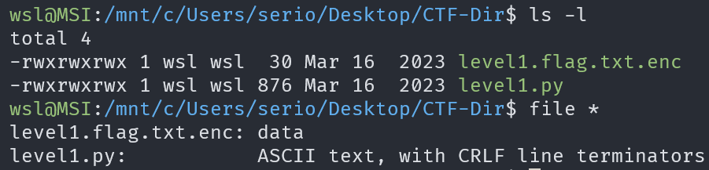
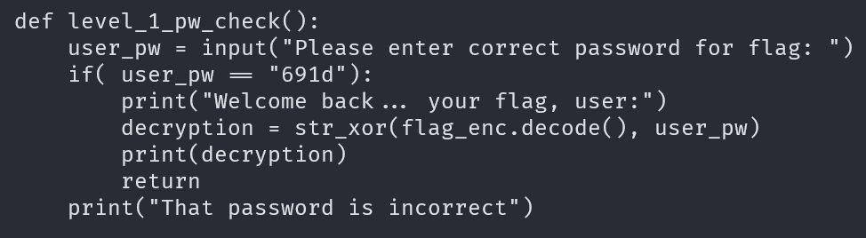
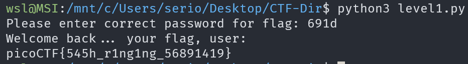

# PW Crack 1

## Description

Can you crack the password to get the flag?

## Approach

For this challenge we are given a python program `level1.py` and an encrypted flag file `level1.flag.txt.enc`

Examining the python program shows that the password is hardcoded in the `level1_pw_check()` function, being `691d`

Finally, we can run the program and enter the password to get the flag

