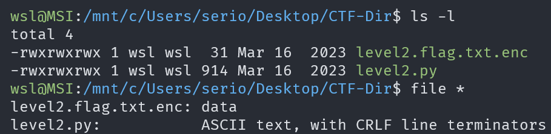
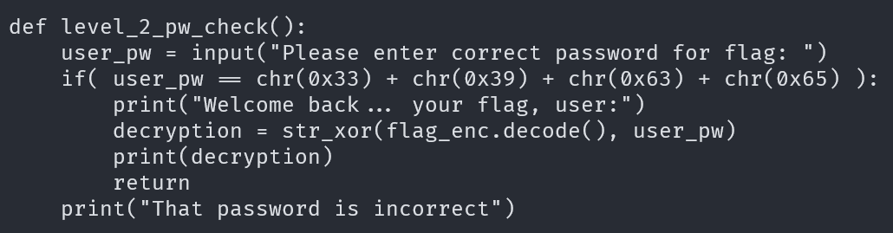
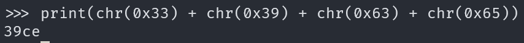
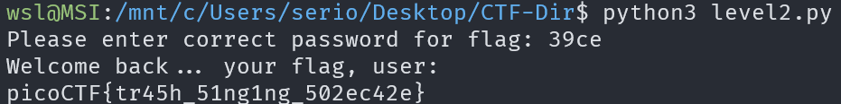

# PW Crack 2

## Description

Can you crack the password to get the flag?

## Approach

This time we are given the following files:

This time in the source code the password is obfuscated using the `char()` and concatenation.

We can actually just get plain text string by copying the `char()` functions and wrapping them in a `print()` function inside the python interpreter

Now we can enter the password and get the flag

