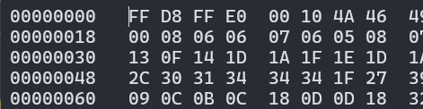

# Corrupted file

**Challenge Link:** <https://play.picoctf.org/practice/challenge/519>

## Description

>This file seems broken... or is it? Maybe a couple of bytes could make all the difference. Can you figure out how to bring it back to life?

## Writeup

After downloading the file I ran `file` on it and got `data` as a result which wasn't all that helpful but indicates that file can't recognize the files type.

Next I ran `strings` on the file and got some interesting results.

```text
JFIF
 $.' ",#
(7),01444
'9=82<.342
!22222222222222222222222222222222222222222222222222
$3br
%&'()*456789:CDEFGHIJSTUVWXYZcdefghijstuvwxyz
        #3R
&'()*56789:CDEFGHIJSTUVWXYZcdefghijstuvwxyz
<Sqaa{w&
neS=
T ^f
(ajI
toQ\
so%z
 9b3
ttW5i
BDAev$
0YDO
T{/6GT
s(vgX
t+qsf
K3n'9
&O*C
xoIIVE
8=3O
I*9'
```

The first item in the list `JFIF`, is a container for `JPEG` files.

If we go read the file using a hex viewer like `xxd file` we can see that the magic numbers of the file are half correct.

`00000000: 5c78 ffe0 0010 4a46 4946 0001 0100 0001  \x....JFIF......`

It's currently `5C78FFE0` but if you check [this](https://en.wikipedia.org/wiki/List_of_file_signatures) list of file signatures it's supposed to be `FFD8FFE0`.

We can change this using a hexeditor like `hexedit`.



Then when we run `file file` it will recognize the file as a JPEG

```sh
wsl@PC01:/tmp/ctf$ file file
file: JPEG image data, JFIF standard 1.01, aspect ratio, density 1x1, segment length 16, baseline, precision 8, 800x500, components 3
```

Then if you open the image you can see the flag!!!
