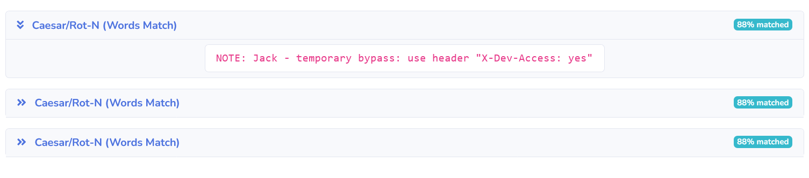
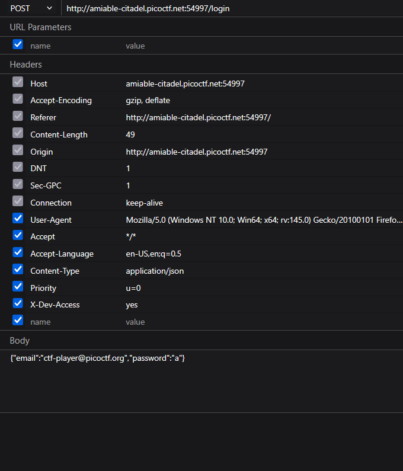
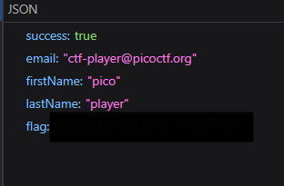

# Crack The Gate 1

**Challenge Link:** <https://play.picoctf.org/practice/challenge/520>

## Description

>We’re in the middle of an investigation. One of our persons of interest, ctf player, is believed to be hiding sensitive data inside a restricted web portal. We’ve uncovered the email address he uses to log in: `ctf-player@picoctf.org`. Unfortunately, we don’t know the password, and the usual guessing techniques haven’t worked. But something feels off... it’s almost like the developer left a secret way in. Can you figure it out?

## Writeup

After navigating to the challenge page we are greeted by a simple login page with an email and password input.


Next I went to the page source because the challenge description strongly hinted at the developer leaving a **backdoor** so I went hunting for comments and found something interesting.

```html
 <!-- ABGR: Wnpx - grzcbenel olcnff: hfr urnqre "K-Qri-Npprff: lrf" -->
<!-- Remove before pushing to production! -->   
```

I could tell the letters look shifted so I use the [CacheSleuth Multidecoder](https://www.cachesleuth.com/multidecoder/index.html) on the text and I got a useful result which revealed the backdoor.



Next I was able to use the **Firefox DevTools Network Tab** to capture a login request using the credentials we were given and added the header to the request.



After sending it I got the flag in the Response tab.


