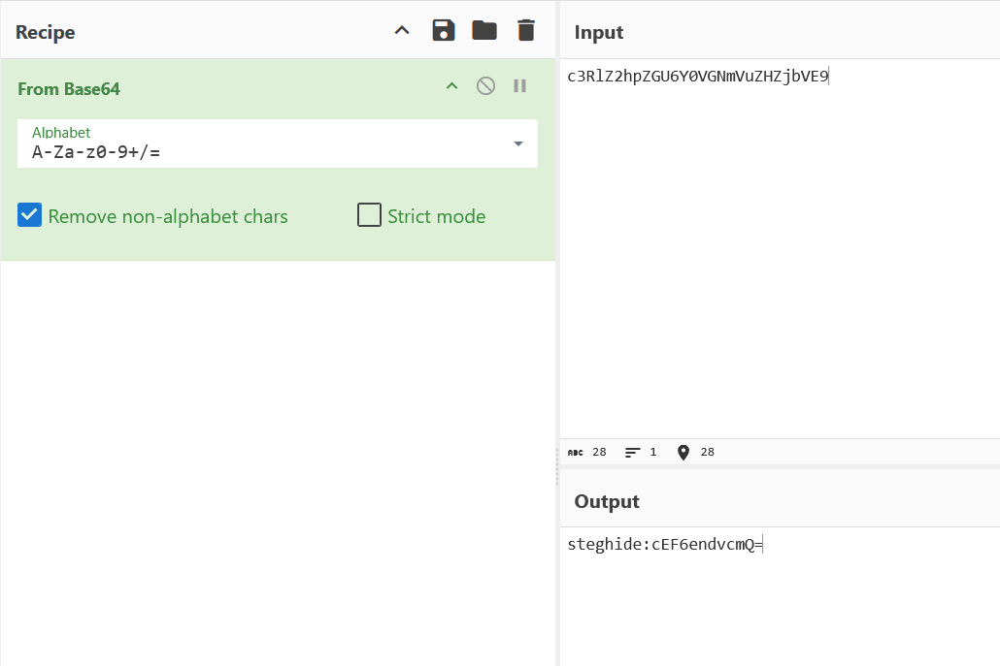
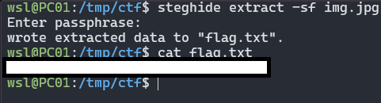

# Hidden in plainsight

**Challenge Link**: <https://play.picoctf.org/practice/challenge/524?category=4&page=1>

## Description

> You’re given a seemingly ordinary JPG image. Something is tucked away out of sight inside the file. Your task is to discover the hidden payload and extract the flag.
>
> Download the jpg image here.

## Writeup

First I downloaded the file `img.png` and ran `file` on it which gave a very interesting result. In the output it showed

>comment: "c3RlZ2hpZGU6Y0VGNmVuZHZjbVE9"

So I instantly put the value of the comment in [CyberChef](https://gchq.github.io/CyberChef/) and found it was base64 and the value was even more interesting

From that I'm going to assume the flag is hidden using stegonography and I can use `steghide` and what ever that encoded value is to get it.

Before I move onto steghide I replaced the the previous value I was checking with `cEF6endvcmQ=` in CyberChef and it gave what looks like a password

Next I used the command `steghide extract -sf img.png` and I got some output to the file `flag.txt` which ended up containing the flag.

