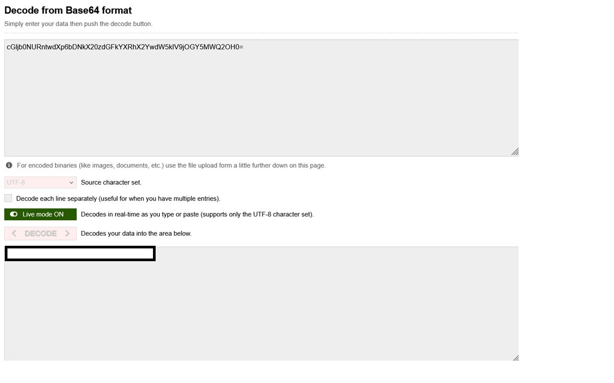

# Riddle Registry

**Challenge Link**: <https://play.picoctf.org/practice/challenge/530?category=4&page=1>

## Description

>Hi, intrepid investigator! 📄🔍 You've stumbled upon a peculiar PDF filled with what seems like nothing more than garbled nonsense. But beware! Not everything is as it appears. Amidst the chaos lies a hidden treasure—an elusive flag waiting to be uncovered.

>Find the PDF file here (Hidden Confidential Document) and uncover the flag within the metadata.

## Writeup

First things first I downloaded the file `confidential.pdf` and ran `file confidential.pdf` to check the file type and if anything interesting comes up. Unfortunately it showed that the file is just a pdf.

Next I ran `exiftool confidential.pdf` to check the metadata of the pdf and the Author field stood out since it looked like base64

Next I just used [some online base64 decoder](https://www.base64decode.org/) and it revealed the flag.

